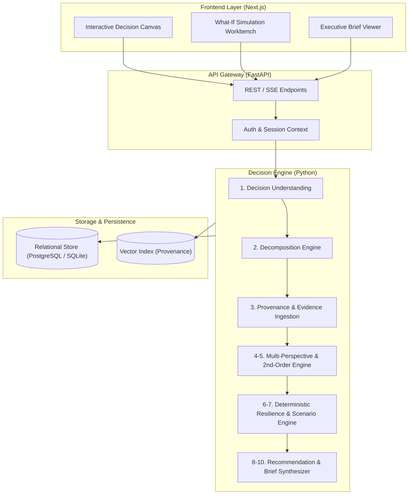

# AURA: Decision-Intelligence Platform

> **Status:** Early Foundation / Day 1 Scaffold  
> **Current Version:** `0.0.1-pre-alpha`  
> **Notice:** Core application logic, APIs, and user interfaces are currently in design. Features described herein outline the planned architecture and roadmap.

---

## 1. Project Overview

**AURA** is an open, structured decision-intelligence platform engineered to assist individuals, technical leads, and organizations in analyzing medium-complexity decisions under uncertainty. 

Standard decision-making frequently suffers from cognitive biases, unstated assumptions, opaque intuition, and unmapped second-order consequences. AURA bridges the gap between unstructured human intent and rigorous, deterministic analysis by decomposing decisions into structured variables, evaluating evidence provenance, stress-testing hypotheses, and producing actionable, conditional recommendations.

---

## 2. Vision

To provide a transparent, explainable cognitive workbench where decisions are not treated as static one-off guesses, but as verifiable, evolving models capable of simulation, sensitivity analysis, and post-decision auditing.

---

## 3. Current Status (Day 1)

The project is currently at **Day 1: Repository Foundation**. 

- [x] Initial workspace layout established ([backend/](file:///c:/Users/Shubh/OneDrive/Desktop/Projects/AURA/AURA/backend), [frontend/](file:///c:/Users/Shubh/OneDrive/Desktop/Projects/AURA/AURA/frontend), [docs/](file:///c:/Users/Shubh/OneDrive/Desktop/Projects/AURA/AURA/docs))
- [x] Polyglot root [.gitignore](file:///c:/Users/Shubh/OneDrive/Desktop/Projects/AURA/AURA/.gitignore) configured (Next.js, FastAPI, Python, Node, Virtual Environments, Secret Isolation)
- [x] Environment configuration templates ([.env.example](file:///c:/Users/Shubh/OneDrive/Desktop/Projects/AURA/AURA/.env.example))
- [ ] Application backend code *(Planned - Next Milestone)*
- [ ] Application frontend code *(Planned - Next Milestone)*
- [ ] Automated decision engine pipelines *(Planned)*

---

## 4. Planned Core Capabilities

The complete AURA system will encompass ten core functional pillars. All capabilities below are **planned** and will be implemented iteratively:

| # | Pillar | Description | Status |
|---|--------|-------------|--------|
| **1** | **Decision Understanding** | Ingests natural-language prompts to identify core decision questions, intent, and operational scope. | 🗓️ *Planned* |
| **2** | **Decision Decomposition** | Deconstructs problems into key variables, constraints, trade-offs, and affected stakeholders. | 🗓️ *Planned* |
| **3** | **Evidence & Source Provenance** | Gathers supporting research and metrics while preserving cryptographic/strict audit trails back to original sources. | 🗓️ *Planned* |
| **4** | **Multi-Perspective Reasoning** | Evaluates decisions through opposing lenses (e.g., risk-averse, growth-oriented, contrarian, ethical). | 🗓️ *Planned* |
| **5** | **Second-Order Effect Analysis** | Identifies cascade reactions, systemic externalities, and non-obvious downstream risks. | 🗓️ *Planned* |
| **6** | **Scenario Generation** | Synthesizes realistic future operating states (base case, stress case, edge case). | 🗓️ *Planned* |
| **7** | **Deterministic Resilience Analysis** | Stress-tests candidate options against constraint boundaries to assess failure tolerance mathematically. | 🗓️ *Planned* |
| **8** | **Conditional Recommendations** | Outputs decision paths formulated as *"If condition X holds, execute Y; otherwise pivot to Z"*. | 🗓️ *Planned* |
| **9** | **What-If Simulations** | Interactive parameter perturbation allowing users to adjust variables and observe real-time outcome shifts. | 🗓️ *Planned* |
| **10** | **Explainable Decision Briefs** | Compiles executive-ready, audit-compliant briefs summarizing logic chains, risks, and rationale. | 🗓️ *Planned* |

---

## 5. Planned Architecture

AURA is architected as a modular, decoupled full-stack platform:



---

## 6. Technology Stack

### Backend
- **Framework:** [FastAPI](https://fastapi.tiangolo.com/) (Asynchronous Python REST API)
- **Language:** Python 3.11+
- **Data Validation & Schemas:** [Pydantic v2](https://docs.pydantic.dev/)
- **Server:** [Uvicorn](https://www.uvicorn.org/)
- **Testing & Quality:** Pytest, Ruff (linting/formatting), Mypy (strict static typing)

### Frontend
- **Framework:** [Next.js](https://nextjs.org/) (App Router, React 19)
- **Language:** TypeScript 5+
- **Styling:** Vanilla CSS / Modern CSS Modules
- **State & Data Fetching:** React Hooks, Server Components, Streaming SSE

### Data & Infrastructure (Target)
- **Local Dev Storage:** SQLite / File-based cache
- **Production Storage:** PostgreSQL + pgvector
- **Version Control & CI:** Git, GitHub Actions

---

## 7. Repository Structure

```text
AURA/
├── .env.example          # Environment variable template
├── .gitignore            # Multi-stack gitignore (Python, Next.js, Node, VS Code)
├── README.md             # Project documentation & roadmap
├── backend/              # Python / FastAPI application service (to be populated)
│   └── (modules, tests, and API routes planned)
├── docs/                 # Architectural specifications, RFCs, and decision records
└── frontend/             # Next.js web application (to be populated)
    └── (components, pages, and styles planned)
```

---

## 8. Local Development Setup (Getting Started)

> *Note: Application packages are currently being initialized. Follow these steps to prepare your local environment.*

### Prerequisites
- **Python:** `^3.11`
- **Node.js:** `^18.18.0` or `^20.0.0`
- **Package Manager:** `npm`, `pnpm`, or `yarn`
- **Git:** `^2.30`

### 1. Clone & Workspace Configuration
```bash
git clone https://github.com/shubh1712/AURA.git
cd AURA
cp .env.example .env
```

### 2. Backend Environment (Preview)
```bash
# Navigate to backend (once initialized)
cd backend

# Create virtual environment
python -m venv .venv

# Activate virtual environment
# Windows (PowerShell):
.venv\Scripts\Activate.ps1
# macOS/Linux:
source .venv/bin/activate

# Install dependencies (upon requirements.txt/pyproject.toml release)
pip install -r requirements.txt
```

### 3. Frontend Environment (Preview)
```bash
# Navigate to frontend (once initialized)
cd frontend

# Install dependencies (upon package.json release)
npm install

# Launch development server
npm run dev
```

---

## 9. Environment Variables

Configuration is managed via root and service-level environment files. See [.env.example](file:///c:/Users/Shubh/OneDrive/Desktop/Projects/AURA/AURA/.env.example) for baseline configuration options:

```bash
# Environment Mode
APP_ENV=development
DEBUG=true

# Backend Service
BACKEND_HOST=127.0.0.1
BACKEND_PORT=8000

# Frontend Service
NEXT_PUBLIC_API_URL=http://127.0.0.1:8000

# LLM & Reasoning Providers (Planned)
OPENAI_API_KEY=
ANTHROPIC_API_KEY=
```

---

## 10. Testing Strategy

Quality and determinism are central to AURA's mission. The testing framework will enforce:

1. **Unit & Domain Model Tests:** Pytest validation for decomposition data contracts and variable boundaries.
2. **Deterministic Engine Tests:** Golden-run regression tests verifying mathematical reproducibility of scenario resilience scoring.
3. **Frontend Component Tests:** Isolation tests for parameter sliders, decision graphs, and brief renderers.
4. **End-to-End (E2E) Workflows:** Automated user journeys from initial decision question input to exportable recommendation brief.
5. **Linting & Type Safety:** Zero-tolerance policies for untyped backend code (`mypy --strict`) and frontend compiler warnings (`tsc --noEmit`).

---

## 11. Future Roadmap

- [x] **Phase 0: Foundation (Day 1 - Current)**
  - Repository structure, polyglot hygiene, architectural baseline documentation.
- [ ] **Phase 1: Domain Modeling & Scaffolding**
  - Backend project initialization (`pyproject.toml`, FastAPI starter, Pydantic schemas).
  - Frontend project initialization (`Next.js`, basic layout, design system).
- [ ] **Phase 2: Decomposition & Provenance Engine**
  - Prompt decomposition pipelines, stakeholder and constraint extraction.
  - Source citation and evidence tracking models.
- [ ] **Phase 3: Multi-Perspective & Second-Order Analysis**
  - Persona-driven evaluation agents and downstream causal dependency mapping.
- [ ] **Phase 4: Deterministic Resilience & What-If Studio**
  - Constraint stress-testing engine, parameter perturbation simulator.
- [ ] **Phase 5: Decision Brief Synthesizer & Auditing**
  - Structured PDF/Markdown export, conditional recommendation generation.

---

## 12. Contributing & License

Contributions, architectural discussions, and RFCs will open following completion of the Phase 1 milestone.

*Licensed under the [MIT License](LICENSE) (or chosen repository license).*
