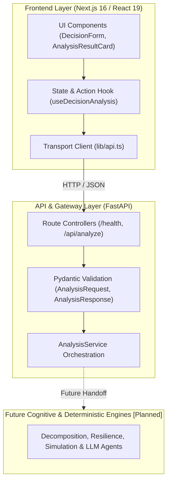
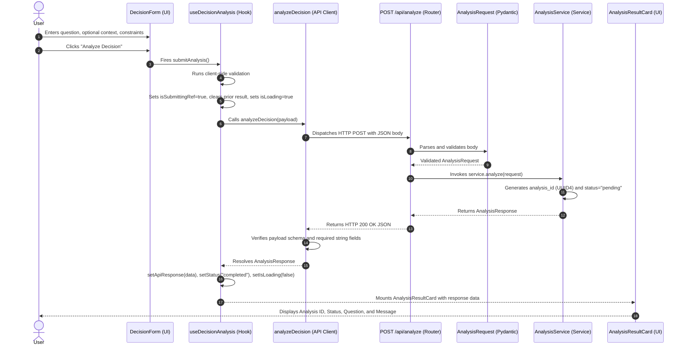

# AURA Architecture: Day 1 Foundation

> **Current Lifecycle:** Day 1 Foundation / Staging Skeleton  
> **Status:** Implemented components are documented as active. Future cognitive and deterministic decision pipelines are explicitly marked as *[Planned]*.

---

## 1. System Overview

AURA is architected as a decoupled, multi-tier decision-intelligence platform. The Day 1 implementation establishes the end-to-end communication backbone, connecting a reactive Next.js client to an extensible FastAPI service orchestrator.

---

## 2. Frontend Architecture

The frontend is built using **Next.js 16 (Turbopack)**, **React 19**, **TypeScript**, and **Tailwind CSS v4**.

### Component Hierarchy
- [`src/app/page.tsx`](file:///d:/AURA/AURA/frontend/src/app/page.tsx): Main workspace layout assembling modular page sections.
- [`src/components/common/Header.tsx`](file:///d:/AURA/AURA/frontend/src/components/common/Header.tsx): Top navigation with AURA branding and real-time backend health monitoring (`/health`).
- [`src/components/decision/DecisionHero.tsx`](file:///d:/AURA/AURA/frontend/src/components/decision/DecisionHero.tsx): Minimal branding header containing the title and product thesis (*"Decision intelligence for complex choices."*).
- [`src/components/decision/DecisionForm.tsx`](file:///d:/AURA/AURA/frontend/src/components/decision/DecisionForm.tsx): Intake form capturing:
  - Required primary question input (*"What decision are you facing?"*)
  - Optional operational context textarea
  - Optional constraints input
  - Action trigger (*"Analyze Decision"*) with loading indicator and validation/error alerts
- [`src/components/decision/AnalysisResultCard.tsx`](file:///d:/AURA/AURA/frontend/src/components/decision/AnalysisResultCard.tsx): Post-intake card rendering the confirmed analysis ID, status badge, formatted question, and backend acknowledgment message.
- [`src/components/ui/`](file:///d:/AURA/AURA/frontend/src/components/ui/): Shared primitives ([`Button`](file:///d:/AURA/AURA/frontend/src/components/ui/Button.tsx), [`Card`](file:///d:/AURA/AURA/frontend/src/components/ui/Card.tsx)).

### State Management & Lifecycle
All form state, error handling, double-click protection, and HTTP lifecycle tracking are encapsulated in the [`useDecisionAnalysis`](file:///d:/AURA/AURA/frontend/src/hooks/useDecisionAnalysis.ts) hook:
- **Ref Guard:** `isSubmittingRef` prevents race conditions or duplicated network requests from rapid double-clicks.
- **State Reset:** Clears previous result cards (`setApiResponse(null)`) upon new submissions to prevent stale data rendering alongside error alerts.
- **Input Sanitization:** Trims questions and parses line/comma-separated constraints into clean string arrays.

---

## 3. Backend Architecture

The backend is written in Python 3.12 utilizing **FastAPI**, **Pydantic v2**, and **Uvicorn**.

### Application Factory
Defined in [`app/main.py`](file:///d:/AURA/AURA/backend/app/main.py):
- Centralizes app creation via `create_application()`.
- Configures CORS middleware allowing communication from `http://localhost:3000` and `http://127.0.0.1:3000`.
- Exposes OpenAPI documentation at `/docs` and `/redoc`.
- Mounts routes modularly (`health_router` at `/health` and `analysis_router` with prefix `/api`).

---

## 4. API Layer

The API layer acts as the strict contract boundary between the client and backend logic:

- **Frontend Client ([`src/lib/api.ts`](file:///d:/AURA/AURA/frontend/src/lib/api.ts)):**
  - Uses native `fetch` with configurable base URL (`process.env.NEXT_PUBLIC_API_BASE_URL` with default fallback to `http://127.0.0.1:8000`).
  - Wraps network failures, HTTP status codes, and malformed JSON into a typed [`ApiClientError`](file:///d:/AURA/AURA/frontend/src/lib/api.ts#L7-L18).
  - Validates response schemas at runtime to prevent malformed payloads from polluting the UI state.
- **Backend Route Handlers:**
  - [`app/api/routes/health.py`](file:///d:/AURA/AURA/backend/app/api/routes/health.py): Lightweight endpoint verifying service readiness.
  - [`app/api/routes/analysis.py`](file:///d:/AURA/AURA/backend/app/api/routes/analysis.py): Thin intake controller validating inputs via Pydantic and delegating execution to `AnalysisService`.

---

## 5. Service Layer

The service layer contains application orchestration and business logic:

- **[`AnalysisService`](file:///d:/AURA/AURA/backend/app/services/analysis_service.py):**
  - Decoupled from HTTP requests and response serializations.
  - Injects into routes via FastAPI's `Depends(get_analysis_service)`.
  - **Day 1 Role:** Serves as the intake orchestrator. Generates a unique UUID `analysis_id`, marks status as `"pending"`, and emits the staging acknowledgment.
  - **Upcoming Role:** Will coordinate downstream cognitive analysis, data gathering, deterministic calculations, and synthesis without modifying route handler signatures.

---

## 6. Schemas & Type Contracts

The system enforces end-to-end type safety across the network boundary:

| Field | Type | Backend Schema (Pydantic) | Frontend Contract (TypeScript) | Description |
|---|---|---|---|---|
| `question` | String | `AnalysisRequest.question` | `AnalysisRequest.question` | Core decision prompt (validated non-empty). |
| `context` | Object / Dict | `AnalysisRequest.context` | `AnalysisRequest.context` | Optional operational background dictionary. |
| `constraints` | Array / List | `AnalysisRequest.constraints` | `AnalysisRequest.constraints` | List of operational or budgetary boundaries. |
| `analysis_id` | String (UUID) | `AnalysisResponse.analysis_id` | `AnalysisResponse.analysis_id` | Unique identifier generated for the decision session. |
| `status` | String | `AnalysisResponse.status` | `AnalysisResponse.status` | Processing state (`"pending"` on Day 1). |
| `message` | String | `AnalysisResponse.message` | `AnalysisResponse.message` | Informational status message. |

---

## 7. Future Engines *(Planned)*

In future milestones, `AnalysisService` will delegate incoming requests to specialized engine modules residing in [`app/engines/`](file:///d:/AURA/AURA/backend/app/engines) and [`app/agents/`](file:///d:/AURA/AURA/backend/app/agents):

1. **Decision Understanding Engine *[Planned]*:** Deconstructs natural-language prompts into variables, objectives, and scope.
2. **Decomposition Engine *[Planned]*:** Maps trade-offs, constraints, and affected stakeholders.
3. **Evidence & Provenance Engine *[Planned]*:** Collects supporting data with strict source audit trails.
4. **Multi-Perspective Reasoning Engine *[Planned]*:** Evaluates decisions through opposing lenses (contrarian, risk-averse, growth).
5. **Second-Order Effect Engine *[Planned]*:** Simulates downstream consequences and systemic externalities.
6. **Scenario Generation Engine *[Planned]*:** Constructs base, stress, and edge-case operating environments.
7. **Deterministic Resilience Engine *[Planned]*:** Evaluates failure thresholds mathematically without relying on non-deterministic LLM arithmetic.
8. **Conditional Recommendation Engine *[Planned]*:** Formulates dynamic *"If X holds, execute Y; otherwise Z"* decision trees.
9. **Simulation Workbench Engine *[Planned]*:** Enables interactive parameter perturbation.
10. **Executive Brief Synthesizer *[Planned]*:** Produces human-readable, audit-compliant decision briefs.

---

## 8. Request Flow

The complete runtime request lifecycle follows this trace:

